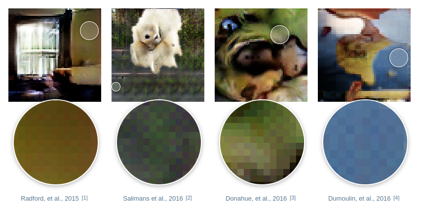

# Trabalho de Conclusão de Curso (TCC)

Trabalho de conclusão de curso (TCC) desenvolvido para concluir o Bacharelado em Ciência da Computação na FCT-Unesp. O tema desse TCC é a comparação de métodos para identificação de imagens faciais geradas por redes neurais generativas. A principal ideia é treinar diferentes métodos que foram desenvolvidos por outros pesquisadores e fazer uma avaliação comparativa da performance deles para diferentes tipos de redes neurais generativas. Dentre esse modelos, todos utilizam abordagens diferentes para fazer a classificação das imagens. Um dos problemas notados é a dificuldade para generalização deles, o que decorre da diferença de algoritmos e métodos que diferentes modelos generativos utilizam para gerar as imagens.

## Justificativa

Redes neurais generativas evoluiram tanto com o passar dos anos que identificar imagens verdadeiras e imagens sintéticas se tornou uma tarefa difícil. Apesar de pontos positivos, elas podem ser usadas para disseminar fake news, espalhando desinformação com objetivo de prejuficar pessoas ou organizações. O intuito desse TCC é comparar e avaliar a qualidades e performance de métodos que já foram criados para deterctar imagens facias geradas sintéticamente.

## Checkerboard artifacts

O checkerboard artifact (ou artefato em padrão de tabuleiro) é um tipo de defeito visual que aparece em imagens geradas por redes neurais, especialmente em redes que usam camadas convolucionais transpostas (também chamadas de deconvolutions) para aumentar a resolução das imagens.

Esse defeito se manifesta como padrões quadriculados ou repetitivos que não existem na imagem original. Ele geralmente acontece porque o modo como os pixels são "espalhados" durante a transposição da convolução pode criar regiões com mais ou menos sobreposição de valores, levando a variações artificiais de intensidade que formam esse padrão.

Esse problema é comum em redes geradoras como GANs, que usam essas camadas para reconstruir imagens maiores a partir de representações compactas.

*Fonte: https://distill.pub/2016/deconv-checkerboard/*
 
Para mais informações é recomendado acessar o site: https://distill.pub/2016/deconv-checkerboard/

# Introdução aos métodos

## Método do Chang

Para fazer a classificação Chang utiliza um filtro SRM (camada convolucional com parâmetros não teináveis), que tem o objetivo de capturar os "defeitos" das imagens. Após aplicação do filtro SRM as imagens são passadas por uma VGG16 que classifica as imagens entre reais e falsas. Ele deu o nome para sua técnica de NA-VGG.

## Método do Cozzolino 1

Cozzalino propõe uma abordagem baseada em contrastive learning para a classificação de imagens. Ele utiliza uma arquitetura ResNet modificada, que preserva melhor os detalhes nas camadas iniciais ao evitar o subsampling. A ideia central é treinar a rede utilizando uma imagem e suas versões aumentadas, incentivando a geração de vetores de características similares para essas variações. Após essa etapa de pré-treinamento, uma camada linear é adicionada para classificar os vetores como provenientes de imagens reais ou sintéticas.

## Método do Cozzolino 2

Seguindo a mesma linha do primeiro método proposto por Cozzolino, este segundo também envolve a extração de vetores de características das imagens, mas com diferenças significativas na arquitetura e no processo de geração dos dados. Neste caso, ele utiliza apenas imagens reais como ponto de partida, que são processadas pelo BLIP para gerar legendas descritivas. Essas legendas são então utilizadas como entrada para um modelo de geração de imagens, como o Stable Diffusion, com o objetivo de criar imagens falsas. A ideia central é que tanto a imagem real quanto a sintética compartilhem a mesma legenda, estabelecendo uma correspondência semântica entre elas.

Para a extração dos vetores de características, utiliza-se o modelo CLIP, que projeta as imagens em um espaço latente multimodal. Após a extração, esses vetores são alimentados em um classificador SVM, responsável por distinguir se a origem do vetor é uma imagem real ou sintética.

## Método do Jeong

Jeong observou que muitas redes generativas apresentam um defeito recorrente conhecido como checkerboard artifact, já explicado anteriormente. Para simular esses artefatos, ele propôs a utilização de três autoencoders com diferentes níveis de downsampling: o primeiro realiza downsampling seis vezes, o segundo duas vezes, e o terceiro não realiza downsampling. A ideia central é reconstruir imagens reais por meio desses autoencoders, de modo a introduzir artefatos similares aos observados em imagens sintéticas. Em seguida, essas imagens reconstruídas são processadas por um pipeline que as encaminha para uma rede responsável por classificá-las como reais ou falsas.

## Método do Raj

Raj propõe um método para detecção de imagens sintéticas que combina técnicas de pré-processamento com uma arquitetura baseada em atenção. Inicialmente, ele extrai dois tipos de informações de cada imagem: ruídos de alta frequência, usando um filtro bilateral, e o espectro PRNU, que evidencia padrões de ruído deixados por sensores reais. Esses dois canais são empilhados e usados como entrada para a rede.

A arquitetura utiliza um mecanismo de patch embedding para dividir a imagem em blocos e projetá-los em um espaço vetorial. Um token de classe é adicionado e processado por um bloco de autoatenção com duas cabeças. Ao final, um classificador utiliza esse token para determinar se a imagem é real ou falsa. O modelo é treinado supervisionadamente com imagens reais e geradas, processadas previamente, e associadas aos seus respectivos rótulos.

## Método do Zhang

Zhang identificou que um dos principais desafios enfrentados pelas redes é o overfitting em relação a um grupo específico de imagens sintéticas. Para contornar esse problema, ele propôs um método inovador baseado no uso de duas redes com a mesma arquitetura, mas treinadas de forma diferenciada. O processo de treinamento ocorre por meio de três rotas distintas:

1. **Rota 1:** Inicia na rede auxiliar e alterna entre camadas da rede auxiliar e da rede principal.  
2. **Rota 2:** Começa pela rede principal e também alterna entre camadas das duas redes.  
3. **Rota 3:** Percorre exclusivamente as camadas da rede principal.

Essa estratégia visa **promover maior generalização** e melhorar a robustez do modelo na detecção de imagens sintéticas geradas por diferentes métodos.

